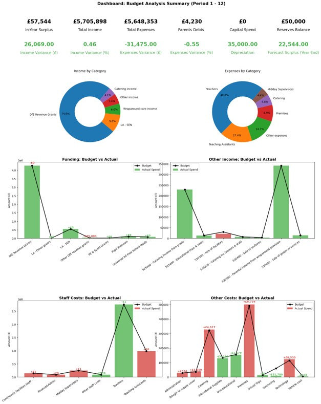
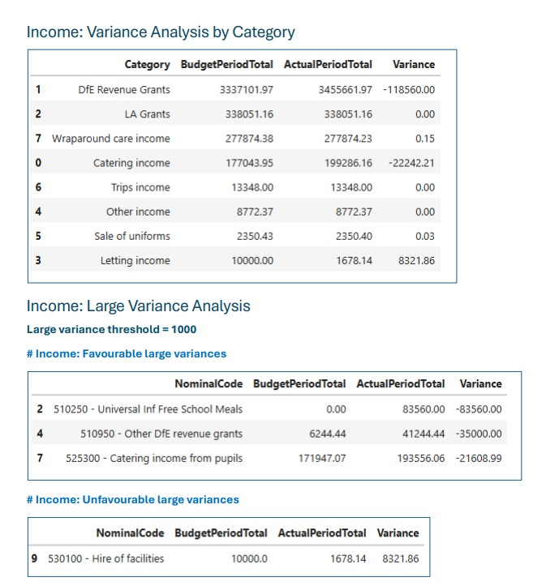
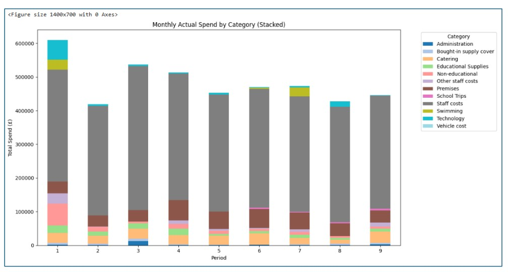
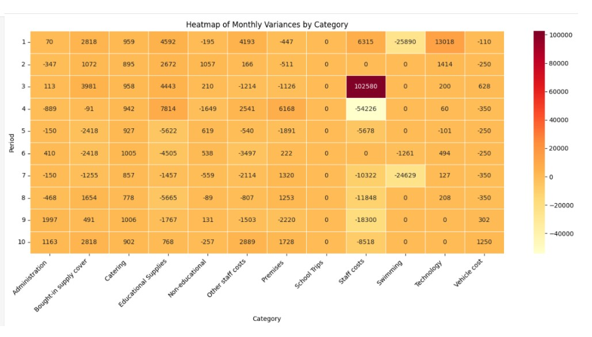

# school_budget_variances_analysis
This project analyses actual income and expenditure against the approved school budget, providing a clear view of financial performance throughout the year. It calculates and reports variances at multiple levels. The project is built in Python using Pandas, with automated data loading and Excel report generation. 

## Key Features
- Variance report (by nominal code)
- Variance report (by categories)
- Income analysis:
- Chart: Income by category (bar chart and donut chart (%))
- Income: Favourable and unfavourable large variance
- Expenses analysis:
- Expenses by category (bar chart and donut chart (%))
- Favourable and unfavourable large variance
- Actual Spend by Month (line chart)
- Monthly Actual Spend by category (Stacked bar chart)
- Heatmap of Monthly Spend by Category
- Heatmap of Monthly Variances by Category
- Dashboard with totals and KPIs
- Variance Reports for export

## Files Included
- `departments.csv` – accounts code mapping
- `annual_budget.csv` – budget
- `transactions.csv` – actual transactions

## Skills Demonstrated
- Loading and processing multiple datasets using `pandas`
- Data preparation
- Building reusable functions
- Merging datasets
- Implementing logic for filtering and grouping data
- Data Visualisation using `Matplotlib` and `Seaborn`
- KPI dashboard layout using `Matplotlib GridSpec`
- Automated Excel export using `openpyxl` and `pd.ExcelWriter`

## Preview (examples)
## Dashboard

## Income Variance Analysis

## Monthly expenses by category

## Heatmap of Variances

